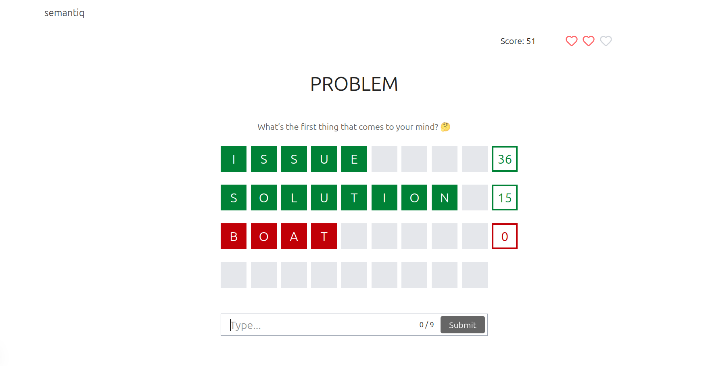

# Data Science Portfolio

## Project 1: A Word Associations Game (`notebooks/word-game.ipynb`)

An interactive word association game built with Data Science and NLP concepts. It uses word embeddings and cosine similarity to score how closely your guesses relate to a target word. The project demonstrates practical applications of embeddings in an engaging, game-like setting.

**Keywords:** `NLP` · `Word Embeddings` · `Cosine Similarity` · `Word2Vec` · `Data Science` · `Machine Learning` · `Next.js` · `Tailwind CSS`
